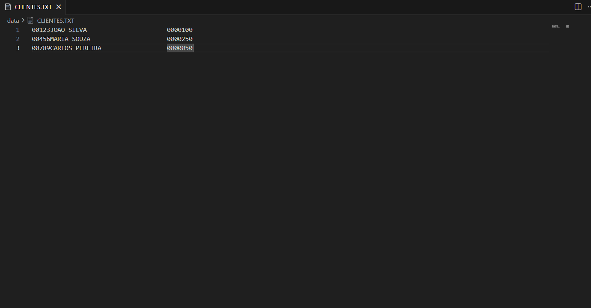
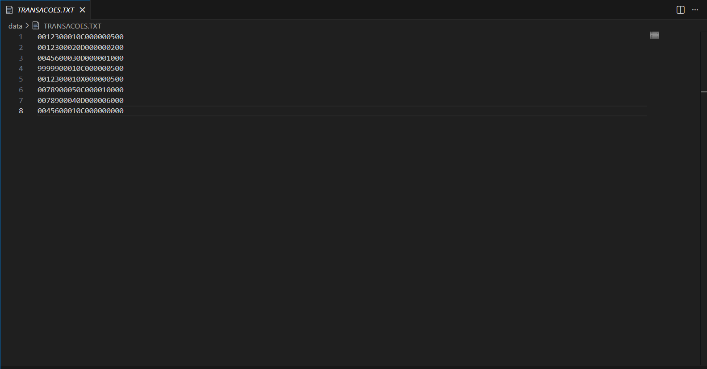
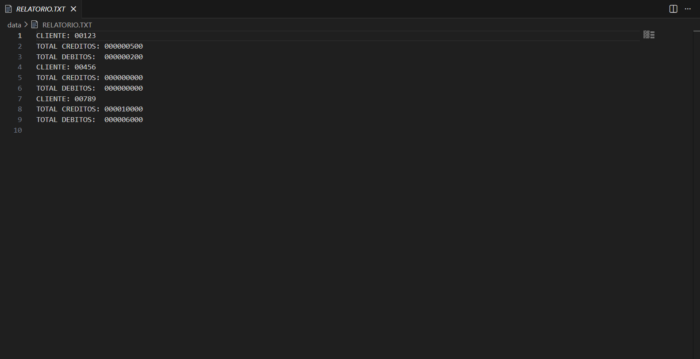
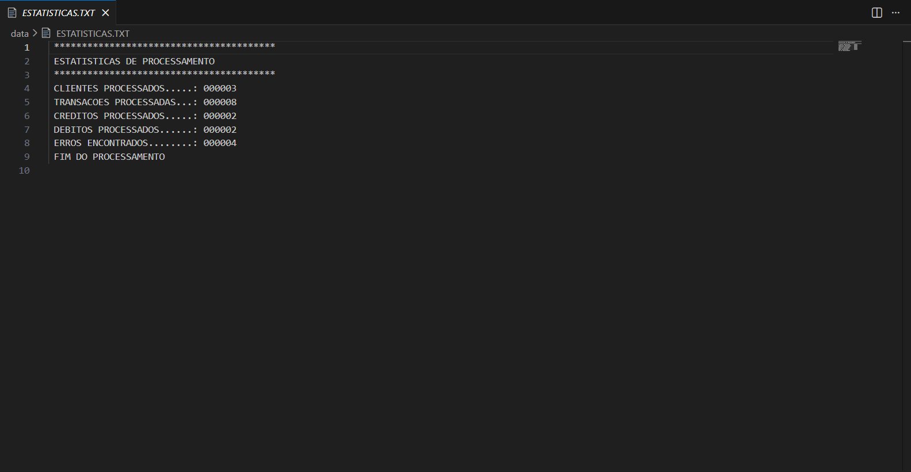
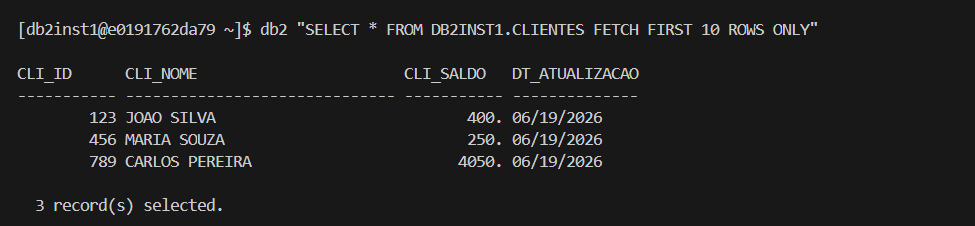
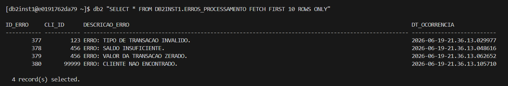
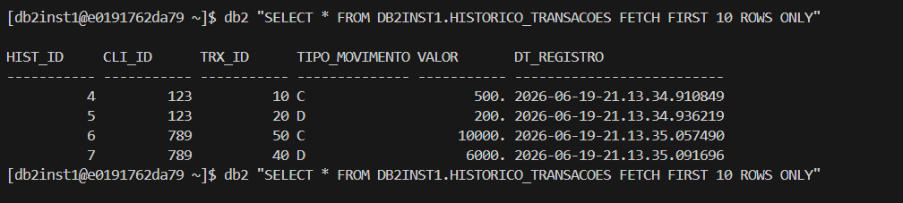
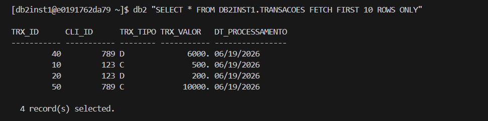
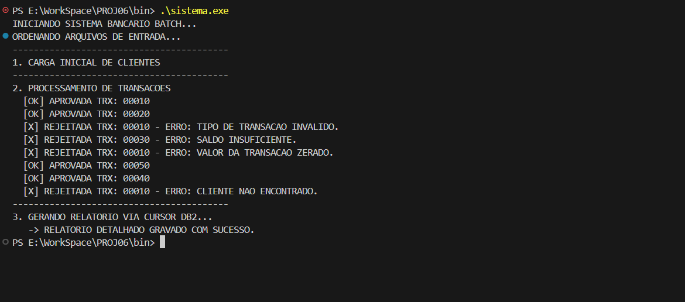
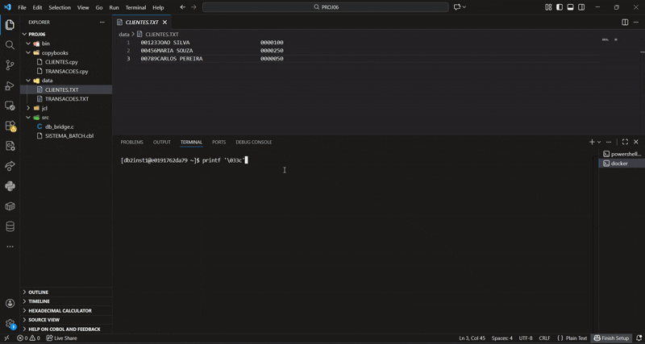

# Projeto 6: Sistema de Contas Bancárias (Batch COBOL + DB2 via C ODBC)

Este projeto consiste em um sistema robusto de processamento em lote (batch) que integra a lógica de negócios procedural do COBOL com a persistência de um banco de dados relacional IBM DB2. 

**Cenário:** Um banco precisa processar diariamente um arquivo contendo transações de débito e crédito dos clientes. As informações dos clientes são armazenadas em tabelas DB2 e devem ser mantidas atualizadas após o processamento das transações. O sistema processa os arquivos de entrada, atualiza os registros do banco de dados, gera arquivos de saída, relatórios detalhados e estatísticas gerenciais da execução.

## Funcionalidades

* **Integração Multicamadas (COBOL -> C -> DB2):** Uso nativo da instrução `CALL` do COBOL para invocar funções em C, que atuam como uma Camada de Acesso a Dados (DAL) utilizando a API ODBC para executar comandos SQL diretamente no DB2.
* **Ordenação Nativa:** Utilização do comando `SORT` interno do COBOL para ordenar os arquivos de texto (`CLIENTES.TXT` e `TRANSACOES.TXT`) em memória, garantindo a leitura sequencial correta.
* **Validação Estrita de Regras de Negócio:** Avaliação de condições de erro em tempo de execução, barrando processamentos indevidos e gerando logs detalhados para:
  * Cliente inexistente no banco de dados.
  * Transações com valor zerado ou negativo.
  * Tipos de transação inválidos (diferentes de 'C' para Crédito ou 'D' para Débito).
  * Saques rejeitados por saldo insuficiente.
* **Controle Transacional Avançado:** Efetivação de `COMMIT` em blocos para otimização de log no DB2 e execução de `ROLLBACK` automático via API em C caso ocorram falhas de inserção, garantindo a integridade dos saldos.
* **Delegação Analítica via Cursores DB2 (Desafio Extra):** Geração do relatório financeiro final utilizando cursores SQL. A lógica de agregação de créditos e débitos (`SUM` com `GROUP BY`) foi transferida do programa para o motor relacional do banco de dados.
* **Auditoria Automatizada via Triggers (Desafio Extra):** Implementação de uma tabela `HISTORICO_TRANSACOES` no DB2 populada automaticamente por uma *Trigger* `AFTER INSERT`, garantindo um registro imutável com *Timestamp* de todas as operações aprovadas.

## Tecnologias

* **Linguagens:** COBOL (GnuCOBOL - Lógica de Negócio) e C (Integração ODBC / Baixo Nível).
* **Banco de Dados:** IBM DB2 (Executado via contêiner Docker).


## Estrutura do Repositório

* `src/SISTEMA_BATCH.cbl`: Código-fonte principal com a árvore de decisão, manipulação de arquivos e chamadas externas.
* `src/db_bridge.c`: API intermediária em C gerenciando a conexão, *statements* SQL, cursores e controle transacional.
* `copybooks/CLIENTES.cpy` e `TRANSACOES.cpy`: Estruturas de *layout* de memória para mapeamento posicional.
* `scripts/SETUP_DB2.sql`: DDL completo para recriação das tabelas principais, índices de otimização e *triggers*.
* `jcl/SISTEMA_BATCH.jcl`: Código JCL com *steps* de limpeza (IDCAMS), ordenação (SORT) e execução no ambiente DB2 (IKJEFT01).
* `jcl/RUN_BATCH.bat`: Script orquestrador executável para simulação no ambiente Windows.
* `data/`: Diretório contendo os arquivos originais e armazenando as saídas (`RELATORIO.TXT`, `ESTATISTICAS.TXT`, `ERROS.TXT`).
* `assets/`: Pasta contendo evidências visuais dos testes de mesa e resultados da execução.

## Como Executar

1. Certifique-se de que o contêiner Docker do DB2 está ativo e que o script `scripts/SETUP_DB2.sql` foi executado para estruturar o banco.
2. Na raiz do projeto, execute o comando de compilação integrando os módulos:
   ```powershell
   cobc -x -free -I copybooks -o bin/sistema.exe src/SISTEMA_BATCH.cbl src/db_bridge.c -lodbc32


## Evidências de Execução
Abaixo, registros que comprovam o funcionamento correto do cruzamento de dados, tratamento de exceções e estatísticas de processamento:

### 1. Arquivos de Entrada




### 2. Relatório e Estatísticas



### 4. Banco de Dados






### 5. Execução


